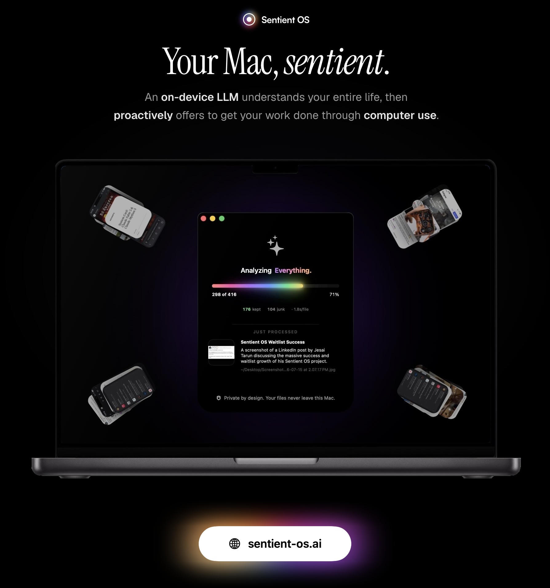
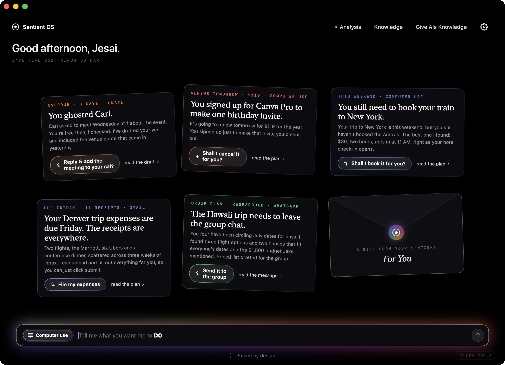
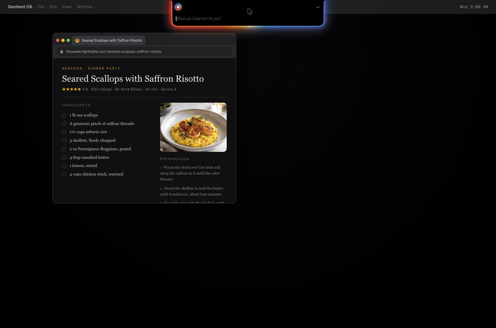
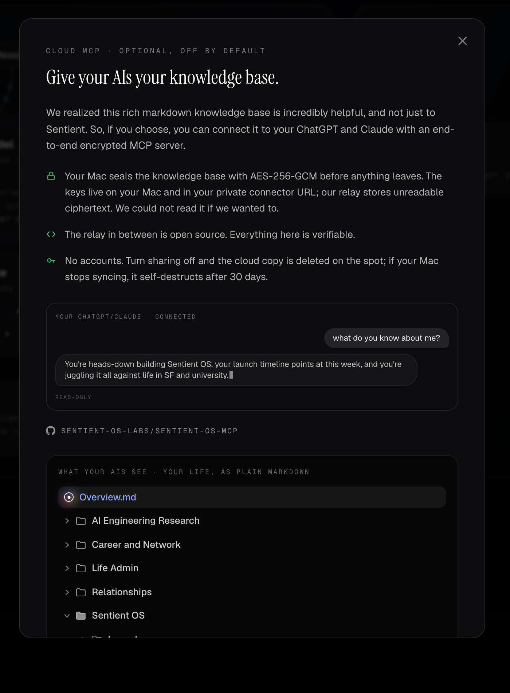
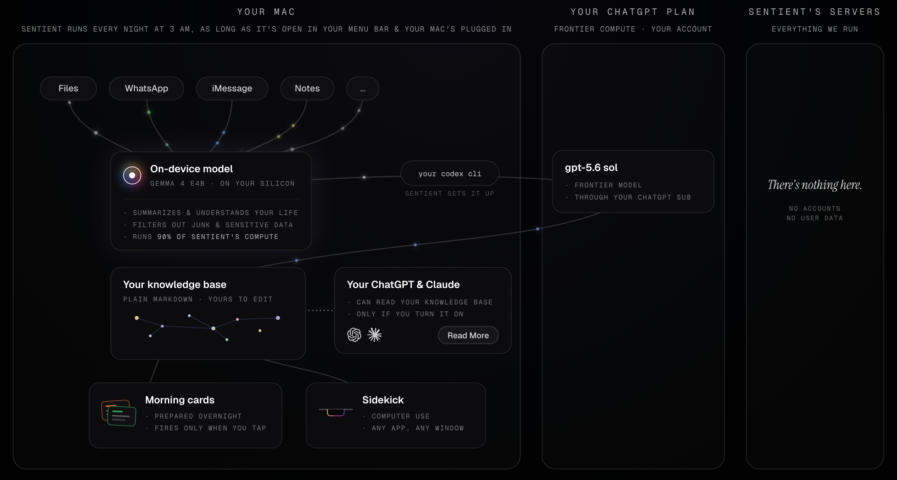

<div align="center">

<a href="https://sentient-os.ai"></a>

<samp>open source · free · optimized for Apple silicon</samp>

</div>

<br/>

Every AI you use today has two problems: it knows nothing about you (nobody can paste their entire life into a chat box), and it only helps when summoned. Fixing both means reading your entire life, every day. In the cloud, that much inference is a fortune and a privacy nightmare. On your own chip, it's free, and nobody else's business.

So every night, Sentient's on-device LLM reads what's new (your files, screenshots, WhatsApp, iMessage, Notes, email) and distills it into a clean markdown knowledge base: the deepest memory of you any AI has ever had. The last 10% of compute taps a frontier model through your own ChatGPT subscription; nothing ever touches a Sentient API key, because there isn't any.

By morning, Sentient offers your grunt work done in one click: that reply you forgot, drafted from your own rich personal context. The subscription you meant to cancel, caught the night before it renews.

And anywhere on your Mac, click the notch and tell Sidekick: "Finish this for me". It uses your apps like you would, even in the background while you carry on.

No accounts, and your raw personal data never leaves your Mac. Free, forever. And every word of this is verifiable right here in this codebase :)

<br/>

## While you sleep, it reads your entire life.

<sub><samp>3:00 AM · ON THIS MAC · NOTHING LEAVES</samp></sub>

At 3 AM every night, Sentient quietly wakes your Mac (lid closed is fine; it falls back asleep after) and reads what's new: files and screenshots, WhatsApp, iMessage, and Apple Notes, decoded straight out of the databases already sitting on your disk. Gmail and Google Calendar ride in through your own OpenAI connectors.

Every single item passes an on-device bouncer. Gemma 4 E4B, running locally, reads it and rules: keep, junk, or sensitive. Junk gets dropped. Sensitive gets dropped harder: no summary, no log, no tombstone, zero trace it ever existed. Only clean, PII-stripped summaries of the keepers survive.

Then the finale: your own codex's frontier model takes those thousands of PII-stripped summaries and distills them into the best possible knowledge base: an Obsidian-style folder of plain markdown, on your Mac, yours to read, edit, and delete note by note. It's not a black box; it's a folder.

<div align="center"></div>

<br/>

## So you wake up to your work finished in one click.

<sub><samp>9:00 AM · PROACTIVE INTELLIGENCE</samp></sub>

<div align="center"></div>

Overnight, a frontier model reads the night's findings against everything it knows about your life and prepares the few things really worth doing. The reply you forgot, drafted from your own rich personal context. The subscription you meant to cancel, caught the night before it renews.

You get a small handful of cards drafted in the morning, which you can read, edit it if you like, and click once to fire. That click is the only thing that ever fires an action.

<br/>

## One more thing. Meet Sidekick.

<sub><samp>HOLD RIGHT ⌘ · ANYWHERE</samp></sub>

<div align="center"></div>

Anywhere on your Mac, click your notch (or use right ⌘: hold to speak, tap to type) and say: "finish this for me", "reply with the update from Sarah", "put these ingredients in my cart". The notch drops open glowing, transcribes you on-device, and computer use takes it from there, in your own apps and your own logged-in browser, with progress streaming live in the notch.

Because every task is grounded in your knowledge base, Sidekick knows who the people in your life are, what "the usual" means, and what you promised whom. That's the difference between an agent, and a proactive agent that knows you.

<br/>

## Give your AIs your knowledge base.

<sub><samp>CLOUD MCP · OPTIONAL, OFF BY DEFAULT</samp></sub>

Somewhere along the way we realized the knowledge base is too useful to keep to ourselves. So, if you choose, you can offer it to the AIs you already use, ChatGPT and Claude, phone apps included, over a cloud MCP server with zero-access encryption.

Connect it, then ask your ChatGPT: *"what do you know about me?"* Et voila.

Your Mac seals the knowledge base with AES-256-GCM before anything leaves. This is zero-access encryption: the key lives only on your Mac and in your private link, never on our servers, which hold nothing but ciphertext and no key to unlock it. Hack our relay and all you'd find is scrambled bytes; unlike a normal cloud backup, where the company keeps your keys and can be compelled to decrypt, we have nothing to hand over. There is no account: turn sharing off and the cloud copy is deleted on the spot, and if your Mac simply stops syncing, the copy self-destructs after 30 days. The relay is open source too: [sentient-os-mcp](https://github.com/Sentient-OS-Labs/sentient-os-mcp).

<div align="center"></div>

<br/>

## Make your Mac sentient.

<sub><samp>FREE · MACOS 15+ · APPLE SILICON · 8 GB IS ENOUGH</samp></sub>

Download the DMG from [the latest release](https://github.com/Sentient-OS-Labs/sentient-os/releases/latest), or use Homebrew:

```sh
brew install --cask sentient-os-labs/tap/sentient-os
```

You'll need an Apple Silicon Mac (M1 or newer) on macOS 15 or later. 8 GB of RAM is enough; we tuned the on-device model until it fit. Keep about 10 GB of disk free before you start: the on-device model is a 3.7 GB download, and it needs room to land.

One requirement: the full version of Sentient runs its cloud compute through your own ChatGPT Plus subscription (about $20 a month, paid to OpenAI, not to us). That's not a catch, that's the architecture: your Mac does about 90% of the compute, your frontier model covers the rest, and that's how Sentient stays free with a straight face. A free ChatGPT account still gets the preview tier: the overnight reading, the knowledge base, the Knowledge window, and the MCP mirror.

Building from source is straightforward: clone, open `Sentient OS macOS.xcodeproj` in Xcode 26, press Run. The on-device model downloads itself during onboarding.

<br/>

## Under the hood.

<sub><samp>YOUR MAC · YOUR CHATGPT PLAN · OUR SERVERS</samp></sub>

The whole architecture in one sentence: your Mac does about 90% of the compute, your ChatGPT subscription does the rest, and our servers do nothing.

<div align="center"></div>

That third column is our favorite thing we've ever shipped, and it's empty on purpose. The local 90% is where the actual engineering lives:

- **The inference engine.** <samp>a custom LiteRT-LM fork, running Gemma 4 E4B</samp>
- **Inference optimization.** <samp>kv cache reuse · flash attention · speculative decoding · self-healing gpu runs · 8 gb macs, welcome</samp>
- **Reading your real life.** <samp>typedstream decoding · protobuf walks · wal-safe copy-reads · date-added, not mtime · never spotlight</samp>
- **Privacy engineering.** <samp>zero-trace triage · fail-closed parsing · a pii regex backstop · aes-256-gcm before anything leaves · a 30-day dead-man lease</samp>
- **The 3 AM machine.** <samp>a codesign-verified root helper · a deadman timer · ac + thermal gates · crash-safe resume</samp>
- **The cloud brain.** <samp>computer use on the plain Codex CLI · frontier compute on your subscription · marginal cost ~$0 · no sentient servers</samp>

And about that cloud brain. Sentient's frontier model is your own Codex CLI, signed into your own ChatGPT account. That includes computer use: OpenAI only ships it inside their desktop app, but the "enable" switch turned out to be a local file copy. So Sentient downloads Codex Computer Use straight from OpenAI and gives it to your Codex CLI, on your machine, and we never host or proxy it.
<br/>

## The privacy flex.

<sub><samp>SIX CORE ELEMENTS · BUILT SO WE DON'T GET A CHOICE</samp></sub>

Most privacy pages are a company promising to behave. This one is a tour of why we don't get the option. Unlike most privacy policies, ours can be summarized in one line:

**We don't collect your private info, ever.**

Here's the machinery that makes that true whether we behave or not:

1. **Raw data never leaves the Mac.** The cloud only ever sees short, PII-stripped, third-person summaries. And behind the model sits a deterministic regex backstop: anything carrying an SSN, card number, or passport number is dropped outright, no appeal.
2. **Junk and sensitive items leave zero trace.** Judged on-device, dropped, gone. Not encrypted, not archived. Nonexistent.
3. **No accounts. Ever.** A random token in your Mac's Keychain is your entire identity to the mirror. We cannot tie a knowledge base to a human being. Can't, not won't.
4. **Deletion is total and boring.** One click removes the cloud copy. Stop syncing and it deletes itself within 30 days anyway.
5. **Your Mac's copy is the real one.** Every cloud copy is disposable by design, and no Sentient server stores anything at rest except the opt-in mirror's ciphertext.
6. **The whole stack is open source.** The app, the relay, all of it, under AGPL-3.0.

Only two optional features ever touch a server at all, and neither bends the line above:

- **The cloud MCP mirror is opt-in, and off by default.** It exists only if you turn it on to give your ChatGPT and Claude your knowledge base. Your Mac seals everything with AES-256-GCM before anything uploads, the key lives only on your Mac and in your private link, and the relay stores only ciphertext with no key to unlock it. The relay's code is open source too.
- **Anonymous diagnostics, and nothing else.** Crash reports (Sentry) and usage analytics (TelemetryDeck), both privacy-focused, open-source frameworks, both structure-only by construction: counts, enums, stack traces, never your content. Your files, summaries, and knowledge base never leave your Mac as part of either. Each has its own off switch in Settings; crash reports turn off completely, and analytics keeps only a handful of extremely anonymized usage-count pings (how many people use Sentient, and how often Sidekick, proactive cards, overnight runs, and the home screen are used), tied to nothing and no one, disclosed right under the toggle.

And one line most companies would bury: features that run through your own Codex CLI are governed by OpenAI's privacy policy, the same one your ChatGPT account already lives under. Your existing relationship with OpenAI, not a new one with us. What's more, even OpenAI never sees your raw life: only the PII-stripped summaries, scrubbed on-device by the model and again by dedicated PII-stripping passes, before anything leaves the Mac.

<br/>

## Questions, answered.

<details>
<summary><b>How is Sentient free? What's the catch?</b></summary>
<br/>

Sentient costs us nothing to run. Your Mac does about 90% of the compute, and the cloud part runs through your own ChatGPT subscription.

As for how we ever make money: enterprise, later. The same engine, with the consumer connectors swapped for work ones like Slack, Granola, Linear, and Notion, becomes a personal intelligence layer for every employee, and companies pay for a license. But nobody has built AI like this before; it's a genuinely new frontier, so we're perfecting it with consumers first. Your data is never the product; we couldn't sell it if we wanted to, because we never have it.

Open source is also personal. [Writing Tools](https://github.com/theJayTea/WritingTools), a repo I built 2 years ago at 17, grew to 2,300 stars, 150 forks, and coverage in over 30 publications. The future of AI, one where it proactively helps you, should be accessible to everyone; that's why all of Sentient is AGPL.

</details>

<details>
<summary><b>Do I need a ChatGPT subscription to use Sentient?</b></summary>
<br/>

Right now, Sentient uses your ChatGPT for cloud compute; the engine isn't tied to any one provider, and we'll open it up to more backends over time. The on-device model does about 90% of the compute, going through your entire life locally; frontier intelligence handles the final 10%: building your knowledge base, verifying and preparing your proactive cards, and running Sidekick.

A free ChatGPT account comes with a small amount of codex compute: enough to build your knowledge base, but not enough to power proactive intelligence or Sidekick (and ChatGPT Go doesn't unlock them either). The full engine needs ChatGPT Plus, about $20 a month, paid to OpenAI, not to us.

We really recommend Plus even if you only want the knowledge base: right now, Sentient connects to your Gmail and Google Calendar through OpenAI's own connectors, which require Plus, and your knowledge base is much nicer with them in it.

</details>

<details>
<summary><b>What actually leaves my Mac?</b></summary>
<br/>

When Sentient reads your life to build your knowledge base, nothing raw leaves: the on-device model reads your files, messages, and screenshots locally and writes short, PII-stripped summaries, and only those go to the frontier model, through your own ChatGPT account. The one thing that could ever send a picture of your screen is Sidekick, and only if you *choose* to grant Sentient the Screen Recording permission, an entirely optional grant that simply sharpens Sidekick's sense of what you're looking at. Grant it, and when you invoke Sidekick a screenshot goes to that same ChatGPT account so the agent can see your screen, never to a Sentient server. Don't, and Sidekick just runs text-only. Your call, always.

If you turn on the optional MCP mirror, your knowledge base is sealed with zero-access encryption before it syncs: the key lives only on your Mac and in your private link, and our relay only ever holds ciphertext with no key to unlock it. And all of it, the app and the servers, is open source under AGPL: don't trust us, read the code at [github.com/Sentient-OS-Labs](https://github.com/Sentient-OS-Labs).

</details>

<details>
<summary><b>When does Sentient do daily processing?</b></summary>
<br/>

Every night at 3 AM, as long as Sentient's open in your menu bar and your Mac's plugged in. Overnight it reads what's new in your life, updates your knowledge base, and prepares your morning cards, so everything's waiting when you wake up.

This works even if your laptop's sleeping with its lid closed: Sentient wakes it quietly for the run and lets it fall back asleep after.

</details>

<details>
<summary><b>Why does it need Full Disk Access?</b></summary>
<br/>

That's how it reads your real life: WhatsApp, iMessage, and Apple Notes live in databases on your Mac that only Full Disk Access can open. Everything's read locally, and the permission never sends anything anywhere. That's the whole trade Sentient makes: deep access on your machine, so nothing needs access in the cloud.

</details>

<details>
<summary><b>Can I see what it knows about me?</b></summary>
<br/>

All of it. The knowledge base is a folder of plain markdown on your Mac, and the built-in Knowledge window lets you read, edit, and delete any of it. If Sentient knows something you'd rather it didn't, delete the note and it's gone everywhere.

And when you want out entirely: one click in Settings wipes the cloud copy and resets the app, and if your Mac simply stops syncing, the mirror self-destructs after 30 days. There was never an account to close.

</details>

<details>
<summary><b>What Macs does it run on?</b></summary>
<br/>

Apple Silicon (M1 or newer) on macOS 15 or later. 8 GB of RAM is enough; the on-device model has inference optimizations to work in it. You'll also want about 10 GB of free disk space when you first set it up, since the on-device model is a 3.7 GB download.

</details>

<br/>

## The docs go deeper.

Every serious subsystem in this repo has a detailed engineering doc in [the Documentation folder](Sentient%20OS%20macOS/Documentation): how iMessage's typedstream actually decodes, why we never touch Spotlight, how a root helper wakes a lid-shut Mac at 3 AM without ever sending you into System Settings, and what it took to make the notch a button. Filled with fun engineering battles from the trenches :)

House rules live here: [CONTRIBUTING.md](CONTRIBUTING.md) · [SECURITY.md](SECURITY.md) · [LICENSING.md](LICENSING.md) · [CLA.md](CLA.md)

<br/>

## Contributing.

We're two people and this repo moves fast. Issues and PRs are welcome, small PRs are beloved, and for anything ambitious please open an issue first so you don't spend a weekend building something we're mid-rewrite on. Setup and house style are in [CONTRIBUTING.md](CONTRIBUTING.md). Outside contributions sign a CLA on the first PR.

<br/>

## Who's building this.

We're Jesai ([GitHub](https://github.com/theJayTea/) & [LinkedIn](https://www.linkedin.com/in/jesai-tarun-37004725a/)) and Aditya ([GitHub](https://github.com/AdityaHemanthVellanki) & [LinkedIn](https://www.linkedin.com/in/adityahemanth/)): two best friends building Sentient full-time from San Francisco, usually at hours our own morning cards would judge us for. We want to push the bounds of what's possible with on-device inference, and the bounds of AI that truly knows you. We believe this next frontier must be built with privacy and accessibility at its core. This is Sentient.

Say hi: [jesai@sentient-os.ai](mailto:jesai@sentient-os.ai)

*Welcome to the future.*

<br/>

---

<div align="center">
<sub><samp>AGPL-3.0 · COMMERCIAL LICENSING IN <a href="LICENSING.md">LICENSING.MD</a> · <a href="https://sentient-os.ai">SENTIENT-OS.AI</a></samp></sub>
</div>
