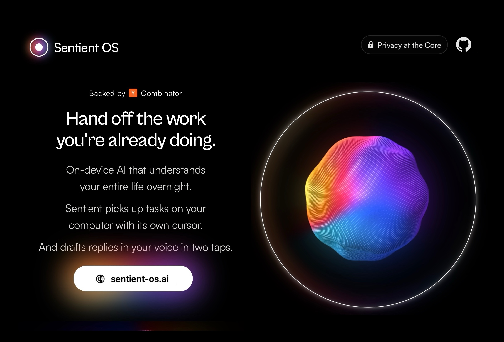
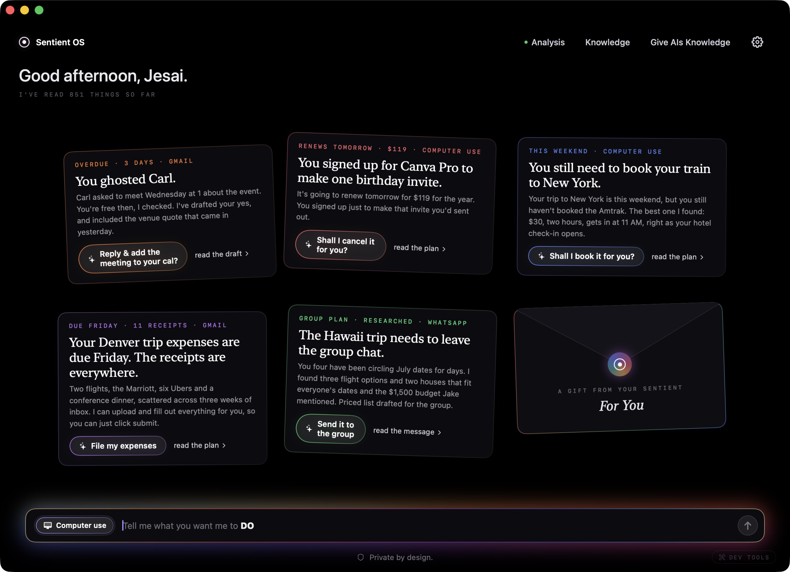
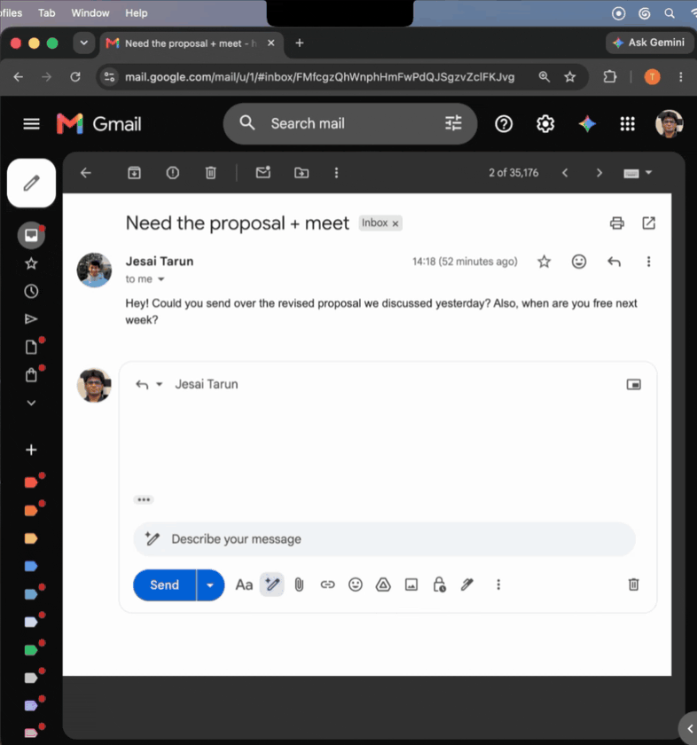
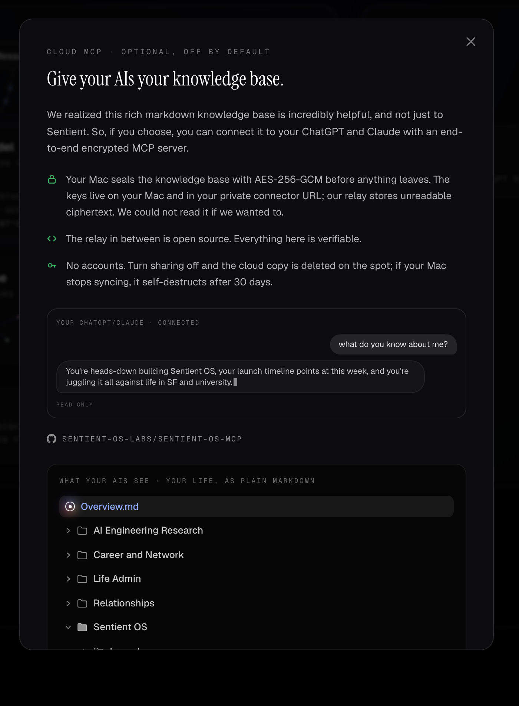
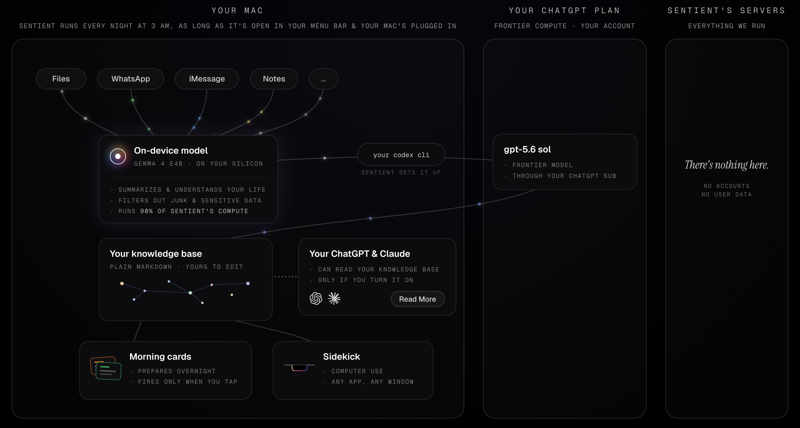

<div align="center">

<a href="https://sentient-os.ai"></a>

<samp>open source · free · optimized for Apple silicon</samp>

</div>

<br/>

Every AI you use today has two problems: it knows nothing about you (nobody can paste their entire life into a chat box), and it only helps when summoned. Fixing both means reading your entire life, every day. In the cloud, that much inference is a fortune and a privacy nightmare. On your own chip, it's free, and nobody else's business.

So every night, Sentient's on-device LLM reads what's new (your files, screenshots, WhatsApp, iMessage, Notes, email) and distills it into a clean markdown knowledge base: the deepest memory of you any AI has ever had. Knowledge-base generation, proactive work, and Sidekick use your own ChatGPT or Claude subscription, or a model endpoint you choose. Double Tap has a separate route, covered by Sentient by default, with your own API provider or a compatible local model available in Settings.

By morning, Sentient offers your grunt work done in one click: that reply you forgot, drafted from your own rich personal context. The subscription you meant to cancel, caught the night before it renews.

And anywhere on your Mac, click the notch and tell Sidekick: "Finish this for me". It uses your apps like you would, even in the background while you carry on.

No signup is required. Local source processing happens on your Mac; cloud features and the context they send are described below and in [SECURITY.md](SECURITY.md).

<br/>

## While you sleep, it reads your entire life.

<sub><samp>3:00 AM · LOCAL SOURCE PROCESSING</samp></sub>

At 3 AM every night, Sentient quietly wakes your Mac (lid closed is fine; it falls back asleep after) and reads what's new from your enabled sources: files and screenshots, WhatsApp, iMessage, Apple Notes, Apple Mail, and Apple Calendar. Apple Mail and Apple Calendar are analyzed locally and work without a ChatGPT or Claude subscription. Hosted email and calendar connectors use your supported AI account.

Every single item passes an on-device bouncer. Gemma 4 E4B, running locally, reads it and rules: keep, junk, or sensitive. Rejected items do not become knowledge summaries. Useful summaries pass through sensitive-content filters and a deterministic PII backstop before reaching your chosen frontier model. Local checkpoints and counts let interrupted processing resume; the filters are not a guarantee that every personal detail has been removed.

Then the finale: your chosen frontier model takes those summaries and distills them into the best possible knowledge base: an Obsidian-style folder of plain markdown, on your Mac, yours to read, edit, and delete note by note. It's not a black box; it's a folder.

<div align="center"></div>

<br/>

## So you wake up to your work finished in one click.

<sub><samp>9:00 AM · PROACTIVE INTELLIGENCE</samp></sub>

<div align="center"></div>

Overnight, a frontier model reads the night's findings against everything it knows about your life and prepares the few things really worth doing. The reply you forgot, drafted from your own rich personal context. The subscription you meant to cancel, caught the night before it renews.

You get a small handful of cards drafted in the morning, which you can read, edit it if you like, and click once to fire. That click is the only thing that ever fires an action.

<br/>

## One more thing. Meet Sidekick.

<sub><samp>HOLD RIGHT ⌘ · ANYWHERE</samp></sub>

<div align="center"></div>

Anywhere on your Mac, click your notch (or use right ⌘: hold to speak, tap to type) and say: "finish this for me", "reply with the update from Sarah", "put these ingredients in my cart". The notch drops open glowing, transcribes your request, and computer use takes it from there, in your own apps and your own logged-in browser, with progress streaming live in the notch.

Because every task is grounded in your knowledge base, Sidekick knows who the people in your life are, what "the usual" means, and what you promised whom. That's the difference between an agent, and a proactive agent that knows you.

<br/>

## Give your AIs your knowledge base.

<sub><samp>CLOUD MCP · OPTIONAL, OFF BY DEFAULT</samp></sub>

Somewhere along the way we realized the knowledge base is too useful to keep to ourselves. So, if you choose, you can offer it to the AIs you already use, ChatGPT and Claude, phone apps included, over a cloud MCP server with zero-access encryption.

Connect it, then ask your ChatGPT: *"what do you know about me?"* Et voila.

Your Mac seals the knowledge base with AES-256-GCM before upload. The optional mirror uses zero-access encryption for stored data: the server stores ciphertext without persisting the decryption key. Your private connector link supplies the secret, and the relay decrypts in memory when serving an authorized request. Keep that link private. Turning sharing off stops sync and requests deletion; network failures can delay that request. An unrefreshed mirror expires after 30 days. The relay is open source too: [sentient-os-mcp](https://github.com/Sentient-OS-Labs/sentient-os-mcp), and [SECURITY.md](SECURITY.md) describes the threat model.

<div align="center"></div>

<br/>

## Make your Mac sentient.

<sub><samp>FREE · MACOS 15+ · APPLE SILICON · 8 GB IS ENOUGH</samp></sub>

Download the DMG from [the latest release](https://github.com/Sentient-OS-Labs/sentient-os/releases/latest), or use Homebrew:

```sh
brew install --cask sentient-os-labs/tap/sentient-os
```

You'll need an Apple Silicon Mac (M1 or newer) on macOS 15 or later. 8 GB of RAM is enough; we tuned the on-device model until it fit. Keep about 10 GB of disk free before you start: the on-device model is a 3.7 GB download, and it needs room to land.

Building from source is straightforward: clone, open `Sentient OS macOS.xcodeproj` in Xcode 26, press Run. The on-device model downloads itself during onboarding.

<br/>

## Under the hood.

<sub><samp>YOUR MAC · YOUR CHATGPT PLAN · OUR SERVERS</samp></sub>

Your Mac processes local sources, and your chosen frontier model builds the knowledge base and powers proactive work and Sidekick. Double Tap can use Sentient's inference relay, your own API provider, or a compatible local model. The optional encrypted MCP mirror, invitation service, and feedback-contact list have separate server paths.

<div align="center"></div>

The illustration shows the local-source and frontier-model pipeline. Double Tap, invitations, feedback contacts, and the optional mirror use the additional server paths described below. The local processing includes:

- **The inference engine.** <samp>a custom LiteRT-LM fork, running Gemma 4 E4B</samp>
- **Inference optimization.** <samp>kv cache reuse · flash attention · speculative decoding · self-healing gpu runs · 8 gb macs, welcome</samp>
- **Reading your real life.** <samp>typedstream decoding · protobuf walks · wal-safe copy-reads · date-added, not mtime · never spotlight</samp>
- **Privacy engineering.** <samp>zero-trace triage · fail-closed parsing · a pii regex backstop · aes-256-gcm before mirror upload · a 30-day dead-man lease</samp>
- **The 3 AM machine.** <samp>a codesign-verified root helper · a deadman timer · ac + thermal gates · crash-safe resume</samp>
- **The cloud brain.** <samp>your own frontier CLI as the brain, native computer-use tools as the hands · frontier compute on your subscription · marginal cost ~$0</samp>

And about that cloud brain. Sentient uses your own ChatGPT or Claude subscription, or a chosen model endpoint, with managed CLI runtimes. All active computer-use backends use OpenAI's signed native helper to act in your own apps and browser, with visible progress and STOP. Dependencies are verified before use. Double Tap's separate inference route is described below.

## The privacy flex.

Local source processing and user-triggered cloud features have different data paths:

1. **Local source analysis stays on your Mac.** Files, local message databases, Apple Mail, and Apple Calendar are analyzed on-device. Useful summaries pass through sensitive-content filtering and a deterministic PII backstop before going to your chosen frontier model.
2. **Rejected items do not become knowledge summaries.** Local checkpoints and counts support reliable processing. Double Tap's separate writing-style setup saves a one-time, editable sample of selected sent messages as `writingstyle.md`; those original examples travel with Double Tap requests and optional knowledge sharing.
3. **Your Mac's knowledge base is canonical.** You can read and edit its Markdown files. Frontier tasks can receive this context, connected-service results, and screen context when needed for the task you started.
4. **The MCP mirror is optional and off by default.** Your Mac encrypts it with AES-256-GCM before upload. Stored data is ciphertext; your private connector link carries the key used to serve requests. One click deletes the mirror, and an unrefreshed copy expires after 30 days. See [SECURITY.md](SECURITY.md) for the threat model.
5. **Double Tap sends reply context to the selected provider.** By default, a screenshot, knowledge-base context including writing examples, and your instructions pass through Sentient's relay to OpenAI. Settings → Double Tap also supports your own API provider or a compatible local model through Ollama or LM Studio. Double Tap drafts into the focused field; you decide whether to send.
6. **Invitations use an anonymous installation identity.** Supabase stores invite codes, redemption dates, and lifetime-access grants. Sentient administrators can access these records. They contain no files, messages, or model credentials; the installation credential stays in Keychain, and Reset preserves lifetime access.
7. **Feedback contacts contain email addresses only.** Completing a supported Gmail or Outlook connection can save the detected address to a separate founder-feedback list, as disclosed before Done. Contact rows contain no installation ID, connector metadata, timestamps, or message content. Reset and uninstall preserve this list. Privacy or removal requests can go to **feedback@sentient-os.ai**; feedback outreach will include an opt-out.

Crash reports (Sentry) and usage analytics (TelemetryDeck) carry structural diagnostics rather than your content. Each has an off switch in Settings. Crash reports turn off completely; disabling analytics retains only the limited usage counts disclosed beside the toggle.

Features using your own Codex CLI, Claude Code, or API provider follow that provider's privacy and retention policies. Voice uses Apple's on-device speech recognition where supported; otherwise Apple's speech service may process audio. The app's Privacy Policy and [SECURITY.md](SECURITY.md) explain these paths alongside the optional mirror, Double Tap, invitations, and feedback contacts.

<br/>

## Questions, answered.

<details>
<summary><b>How is Sentient free? What's the catch?</b></summary>
<br/>

Local processing runs on your Mac, and frontier tasks use your own subscription or chosen endpoint. Sentient covers Double Tap's default relay route; you can also choose your own API provider or a compatible local model in Settings.

As for how we ever make money: enterprise, later. The same engine, with the consumer connectors swapped for work ones like Slack, Granola, Linear, and Notion, becomes a personal intelligence layer for every employee, and companies pay for a license. But nobody has built AI like this before; it's a genuinely new frontier, so we're perfecting it with consumers first. Your data is never the product.

AI that proactively helps you should be accessible to everyone. Sentient is open source under the AGPL so anyone can inspect, build, and improve it.

</details>

<details>
<summary><b>Do I need a ChatGPT subscription? Or can it run fully locally?</b></summary>
<br/>

No. The on-device model does about 90% of the compute, going through your entire life locally; frontier intelligence handles the final 10% (the final stage of knowledge base creation, proactive intelligence, and running Sidekick).

That 10% isn't tied to any one provider and you have many choices:

- **Your ChatGPT subscription**
- **A local model through LM Studio**
- **Any model on OpenRouter**
- **Your Claude subscription**
- **Any other frontier model you want to connect**: anything that speaks the OpenAI Responses API works, including fully self-hosted

If you go the ChatGPT route:

- A free ChatGPT account comes with a small amount of codex compute, enough to build your knowledge base, but not enough to power proactive intelligence or Sidekick (and ChatGPT Go doesn't unlock them either).
- The full engine needs ChatGPT Plus, about $20 a month, paid to OpenAI, not to us.

Hosted Gmail and calendar connectors require a supported AI account. Apple Mail and Apple Calendar are local sources and work without a ChatGPT or Claude subscription.

</details>

<details>
<summary><b>What actually leaves my Mac?</b></summary>
<br/>

The local ingestion pipeline sends filtered summaries to your chosen frontier model. Proactive tasks and Sidekick can also use your knowledge base, connected-service context, and screenshots for the task you started. Double Tap sends a screenshot, knowledge-base context including selected writing examples, and instructions through Sentient's relay to OpenAI by default, or to your own configured provider, including a compatible local model.

The optional MCP mirror uploads an encrypted knowledge base, including writing examples and files you add to that folder. Invitations store codes and access grants under an anonymous installation identity. Supported email connection flows can save an email address to the separate feedback list. Diagnostics send the structural information described above. [SECURITY.md](SECURITY.md) explains the data paths and permission boundaries.

</details>

<details>
<summary><b>When does Sentient do daily processing?</b></summary>
<br/>

Every night at 3 AM, as long as Sentient's open in your menu bar and your Mac's plugged in. Overnight it reads what's new in your life, updates your knowledge base, and prepares your morning cards, so everything's waiting when you wake up.

This works even if your laptop's sleeping with its lid closed: Sentient wakes it quietly for the run and lets it fall back asleep after.

</details>

<details>
<summary><b>Why does it need Full Disk Access?</b></summary>
<br/>

Full Disk Access lets the local readers access WhatsApp, iMessage, Apple Notes, and Apple Mail data on your Mac. Source selection controls regular analysis, and writing-style setup has its own sample scope. Apple Calendar uses a separate macOS calendar permission. These permissions enable local reading; the inference and sharing paths above determine what context leaves your Mac.

</details>

<details>
<summary><b>Can I see what it knows about me?</b></summary>
<br/>

All of it. The knowledge base is a folder of plain markdown on your Mac, and the built-in Knowledge window lets you read, edit, and delete any of it. If Sentient knows something you'd rather it didn't, edit or delete the note. Changes sync to the optional mirror when it is enabled and reachable; previously processed provider requests follow that provider's retention settings.

Settings lets you request deletion of the cloud mirror and reset the app. An unrefreshed mirror expires after 30 days. Reset preserves invitation and lifetime-access records, as well as the separate feedback-contact list. For contact removal, email **feedback@sentient-os.ai**.

</details>

<details>
<summary><b>What Macs does it run on?</b></summary>
<br/>

Apple Silicon (M1 or newer) on macOS 15 or later. 8 GB of RAM is enough; the on-device model has inference optimizations to work in it. You'll also want about 10 GB of free disk space when you first set it up, since the on-device model is a 3.7 GB download.

</details>

<br/>

## The docs go deeper.

Every serious subsystem in this repo has a detailed engineering doc sitting right next to its code (each feature folder under `Sentient OS macOS/` carries a `Documentation - <Feature>.md`; [the map lives here](Sentient%20OS%20macOS/Documentation%20-%20General%20-%20README.md)): how iMessage's typedstream actually decodes, why we never touch Spotlight, how a root helper wakes a lid-shut Mac at 3 AM without ever sending you into System Settings, and what it took to make the notch a button. Filled with fun engineering battles from the trenches :)

House rules live here: [CONTRIBUTING.md](CONTRIBUTING.md) · [SECURITY.md](SECURITY.md) · [LICENSING.md](LICENSING.md) · [CLA.md](CLA.md)

<br/>

## Contributing.

This repo moves fast. Issues and PRs are welcome, small PRs are beloved, and for anything ambitious please open an issue first so you don't spend a weekend building something we're mid-rewrite on. Setup and house style are in [CONTRIBUTING.md](CONTRIBUTING.md). Outside contributions sign a CLA on the first PR.

<br/>


---

<div align="center">
<sub><samp>AGPL-3.0 · COMMERCIAL LICENSING IN <a href="LICENSING.md">LICENSING.MD</a> · <a href="https://sentient-os.ai">SENTIENT-OS.AI</a></samp></sub>
</div>
