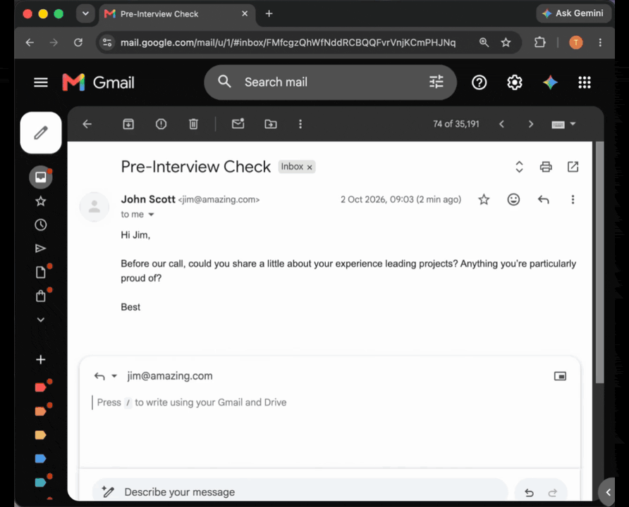
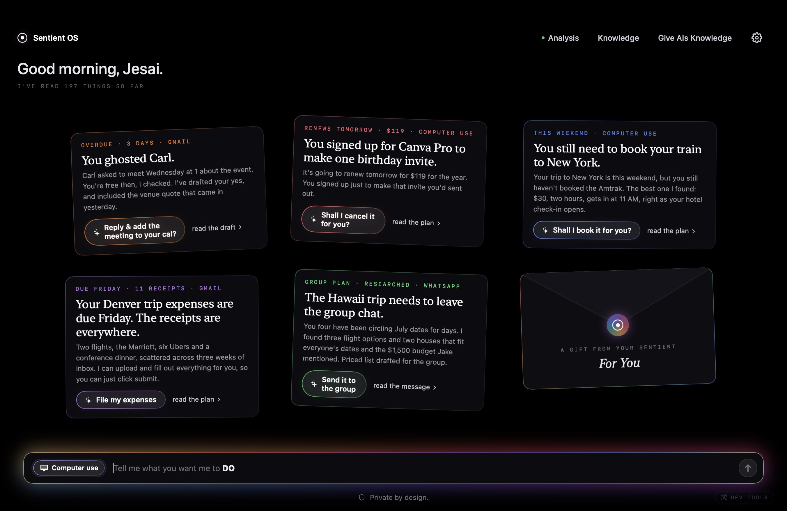
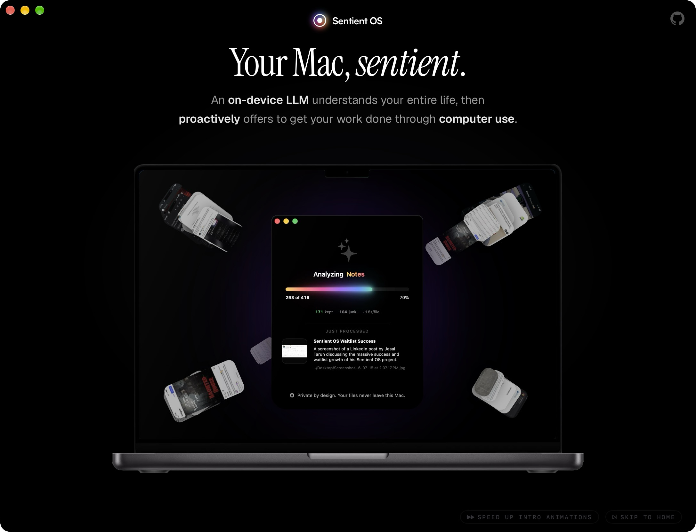
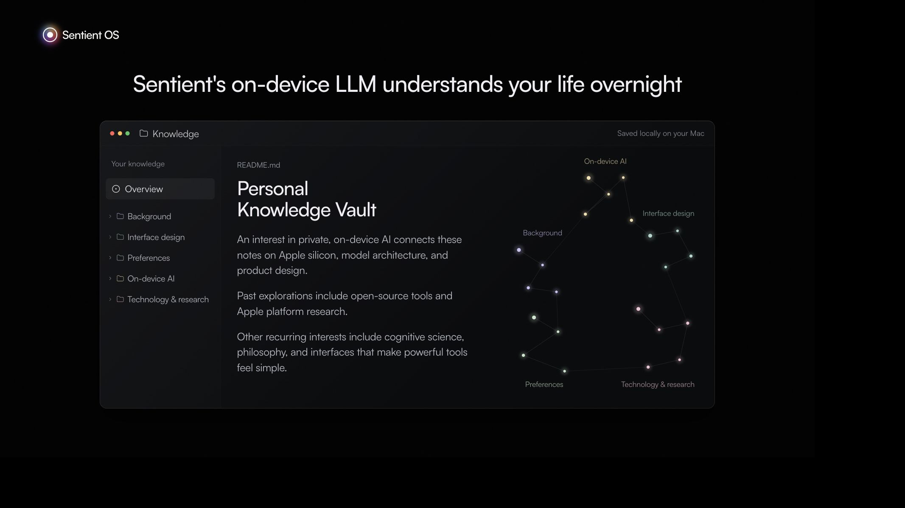

<p align="center">
  <a href="https://sentient-os.ai/">
    
  </a>
</p>

Sentient OS is an open-source personal AI for your Mac. It understands the context of your life and work overnight, so you can hand off a task, draft the right reply in two taps, or wake up to useful work already prepared for your approval. Your own apps. Your logged-in browser. The stuff you were about to do yourself.

**On-device understanding. Your choice of AI. Knowledge you own.** We do the high-volume understanding on your Mac, keep your knowledge in ordinary Markdown files, and let you choose the model that puts it to work. A compatible local model can handle the rest of the inference too :)

[**download for macOS**](https://github.com/Sentient-OS-Labs/sentient-os/releases/latest) · [watch it work](https://sentient-os.ai/) · [for teams](#your-team-has-better-things-to-do) · [privacy](#personal-ai-privacy-at-its-core)

```sh
brew install --cask sentient-os-labs/tap/sentient-os
```

<sub>Apple silicon, M1 or newer · macOS 15.4+ · 8 GB RAM for the built-in model · about 10 GB free for initial setup</sub>

<sub>Our next 1,000 users keep Sentient free for life. Your chosen AI provider's charges, if any, are separate.</sub>

[sidekick](#a-little-handoff-a-lot-off-your-plate) · [double tap](#the-reply-you-meant-to-send) · [proactive intelligence](#a-head-start-before-you-even-ask) · [local inference](#all-the-ai-on-your-own-mac) · [under the hood](#our-engine-your-silicon) · [faq](#a-few-good-questions) · [build from source](#make-it-yours)

## the task is small. the briefing isn't.

Computer-use agents can already take on ambitious jobs. But look at the little chores scattered through your day: a half-filled application, a customer waiting for an update, receipts stranded across your inbox, another form asking for the same things about you.

First, explain what you're looking at. Who this person is. What you agreed last week. Which project the question is about. Where the relevant file lives.

At some point, doing it yourself feels quicker. So you do. Again.

**Sentient does the catching up before you ask.** Overnight, it builds a connected understanding of the sources you choose. By day, that knowledge and your screen give a short request somewhere to start. Click the notch: “finish this for me.” Sidekick picks up the task in your own apps, with its own cursor, while you carry on.

Think of a butler who already knows what's going on, and happens to live in your Mac's notch. A rather useful place to keep one :v

## a little handoff. a lot off your plate.

<sub><samp>sidekick · when you ask</samp></sub>

Click the notch, tap your right Command key to type, or hold it to speak. **Sidekick has its own mouse cursor, so it can use your apps while you keep using your computer.** It brings your screen and knowledge into the task, clicking, typing, attaching files and moving between windows on your behalf.

<p align="center">
  
</p>

<sub>The Sidekick recording from our homepage, looping. [More Sidekick in action.](https://youtu.be/wI6uwOlrTjA)</sub>

**For your life:**

- **Take over anything.** Sentient connects the dots across your life and work from the sources you choose. Hand off whatever you're doing with “finish this for me,” and let it pick up the task with your context already in place.
- **Finish applications.** Pick up the one already open in your browser, with your background in context.
- **Fill out forms.** Hand off the familiar details you've typed a hundred times before.
- **Unsubscribe from junk email.** Let Sidekick work through the unsubscribe flow while you get on with your day.
- **Order items.** Turn the things you're looking at into a shopping task, right from the page.
- **Book flights.** Hand off the booking steps in your own browser, with your travel plans as context.

**For your work:**

- **File my expenses.** Fill the report, attach the matching flight, hotel and dinner receipts, and leave a draft ready to review.
- **Update the CRM.** Carry the call's decisions into the deal: proposal stage, revised scope, next step, and the follow-up you agreed on.
- **Finish this form.** Fill the vendor portal's company details without making you reconstruct your business in another prompt.

The useful detail often lives somewhere else: a meeting note, a conversation, a file on your Mac. Sidekick brings it into the task.

## the reply you meant to send.

<sub><samp>double tap · in two taps</samp></sub>

Fifteen unread messages. Several perfectly lovely people. Somehow, answering them has become an entire afternoon's ambition :c

Put your cursor in a reply field and double tap your **right Command key**. Double Tap uses the conversation on screen, your knowledge, and a one-time set of writing examples to draft a reply in your voice, right there. Read it, tweak it, send it. **The draft stays unsent.**

<p align="center">
  
</p>

<sub>Email → Slack → iMessage, just like the homepage. Three short app recordings; every reply stays a draft.</sub>

**For your life:**

- **Reply to plans.** A friend asks about the trip. Draft a reply with the booking details already in your context, right there in iMessage.
- **Answer the question.** Bring a relevant detail into an email reply without digging through old threads first.
- **Don't ghost people.** Get back to someone before “I'll reply later” becomes a week. Still your voice, just less staring at the reply box :)

**For your work:**

- **“Any update on the rollout?”** Reply to a coworker with the latest project context: the first group is live, and the final QA pass is pending.
- **“Where did we land on this?”** Bring the decision from your meeting notes back into the conversation: core workflow first, extra settings later.
- **“Can you send a quick recap?”** Pull together the agreed scope, first milestone and questions still open.
- **“Can we move tomorrow's meeting?”** Draft the scheduling reply while keeping the existing agenda in view.

An informed draft, in the email or Slack conversation you're already having. No need to rummage through three other apps before you can answer.

Writing examples are editable in `writingstyle.md`; Sentient doesn't continuously collect new ones. Double Tap also has its **own provider setting**, including compatible local models. Both live in **Settings → Double Tap**. If you change Sidekick's shortcut to right Option, Double Tap follows that choice.

## a head start. before you even ask.

<sub><samp>proactive intelligence · before you ask</samp></sub>

Some work slips because you forgot it existed. Sentient looks for those loose ends, researches them, and prepares the next step. A draft with the relevant details. A nudge before a deadline becomes a scramble.



<sub>Example morning cards. Review a draft or plan, edit it, then choose whether to act.</sub>

**For your life:** catch the reply you owe Carl, the Canva trial about to renew, or the train you still haven't booked. Gather the Denver trip receipts before expenses are due. Turn the Hawaii group chat's scattered dates and budget into a researched shortlist.

**For your work:** follow up on the proposal that went quiet. Catch a trial before it becomes a bill. Prepare the customer update you promised yesterday, assemble Friday's expenses, or pull the open questions into tomorrow's kickoff agenda.

**Overnight preparation doesn't send the message or execute the proposed task.** You review the offer and click to start it. The point is to have your back without taking over your decisions.

## your team has better things to do.

Customer follow-ups. Project updates. Forms, meetings, receipts. The work between the work adds up, especially when you're a small team and everyone is holding six different threads in their head.

Clear the morning reply pile, hand off repetitive steps, and catch the promises that would otherwise get buried. A little more room for your team's actual work.

**For a limited time, our first teams get all of Sentient for free.**

[Contact Sentient about your team](mailto:feedback@sentient-os.ai?subject=Sentient%20for%20our%20team)

## your mac, on the night shift.

At **3 AM**, Sentient can wake your plugged-in Mac, even with the lid closed. It reads what's new in the local sources you've enabled, updates your knowledge with your chosen AI, and prepares suggestions for the morning. Then it lets the Mac go back to sleep.



<sub>The local-analysis stage, shown in the onboarding film. Knowledge organization and task inference use the AI you choose.</sub>

Your files, saved screenshots, iMessage, WhatsApp, Apple Notes, **Apple Mail and Apple Calendar** can all feed the on-device model. Useful summaries become connected notes about your people, projects, plans and preferences. Your chosen frontier model consolidates them into the knowledge base that powers the day's assistance.

Keep Sentient running in the menu bar with overnight wake set up. Plugged in is the default; battery runs are an explicit option, with charge and thermal checks.

Getting a sleeping, lid-shut Mac to wake up, run local inference, and return to sleep took some exploring. The result is a purpose-built wake helper, bounded awake sessions, and checkpoints that let interrupted processing resume. [The scheduler's engineering story is here.](Sentient%20OS%20macOS/Scheduling/Documentation%20-%20Overnight%20Scheduler%20%26%20Wake%20Helper.md)

## personal ai. privacy at its core.

A tiny handoff needs rich context, and rich context takes a lot of inference. Putting the repeated reading of thousands of messages, emails, files and more on your own chip makes it practical and free of per-call cloud costs, while keeping the triage of some of your most personal data as private as possible.

**On-device first.** Selected local sources are analyzed on your Mac, without uploading each file or conversation for that first pass. Filters help discard irrelevant material and common sensitive identifiers before useful summaries move into knowledge organization.

```text
selected local sources
        ↓
on-device understanding
        ↓
useful summaries
        ↓
your chosen AI, local or hosted
        ↓
knowledge in a folder on your Mac
        ↓
help in the apps you're already using
```

**Your mailbox doesn't need a Sentient-hosted login.** Apple Mail and Apple Calendar let Sentient analyze data already synced to your Mac. Alternatively, supported Gmail and Outlook connections use your own ChatGPT or Claude account. You don't have to grant a Sentient-hosted Google or Microsoft app access to your inbox. When you use a hosted model, that provider processes the context for its work under your chosen account's settings.

**Your knowledge belongs to you.** It's a folder of ordinary Markdown files at `~/Sentient OS - Knowledge Base/`. Read it, correct it, keep a copy, open it in your favorite editor. The Knowledge window gives you a reader and a constellation of connected notes; both look into the same folder.



<sub>Example knowledge, with personal details omitted. Plain files underneath.</sub>

**Double Tap has a separate choice.** For low latency, we cover an OpenAI API route with **Zero Data Retention, free** for our first users. You can choose your own provider for Double Tap in **Settings → Double Tap**, including a compatible local model. A screenshot of the display under your pointer, your knowledge including one-time writing examples, and your instructions pass through our relay when you use the covered route to make an unsent draft.

**Sharing with other AIs is optional.** Enable cloud MCP sharing to let compatible AI apps read your knowledge, including from your phone. Your Mac encrypts the folder with AES-256-GCM before upload. The relay stores encrypted knowledge without persisting the decryption key; your private link supplies the secret for authorized requests, which are served through in-memory decryption. Sharing includes your writing examples and files you add to the folder. Keep that link private.

The app and supporting infrastructure are open source. No separate Sentient account is required, and we do not sell your personal information or share it for cross-site targeted advertising. [Explore privacy](https://sentient-os.ai/privacy-core), read the [full policy](https://sentient-os.ai/privacy), or inspect the [security and data-flow explanation](SECURITY.md).

## all the ai, on your own mac.

The built-in model handles the high-volume reading. You can also run a **larger local model** for knowledge organization, proactive intelligence and Sidekick, plus a local drafting model for Double Tap. No ChatGPT or Claude subscription required.

Once the models and runtimes are downloaded, all AI inference can happen locally, including offline. Browsing websites and sending email still need internet.

To set it up:

1. Run a compatible vision-capable model in LM Studio or another supported local server. The main frontier connection uses the Responses API and a vision check.
2. Select it in **Settings → Frontier Model Choice**.
3. Select a local drafting provider separately in **Settings → Double Tap**. This client supports compatible Responses and Chat Completions endpoints, including LM Studio and Ollama.
4. Use local knowledge sources, including Apple Mail and Calendar, and leave optional cloud sharing off.

A model such as [Qwen3.8-27B](https://huggingface.co/Qwen/Qwen3.8-27B) gives a sense of the larger vision models available. Fit depends on quantization, context size and spare memory. The model and server also need to support the task. **The 8 GB baseline covers Sentient's built-in model, not an additional 27B model.**

Prefer a hosted frontier model? Use your ChatGPT or Claude account, OpenRouter, or another compatible endpoint. The knowledge stays yours whichever route you choose. Updates, diagnostics and connected online services have separate settings and network behavior.

## our engine. your silicon.

Reading one document is easy to demo. Working through a changing pile of files, images, conversations and mail every night, on someone's everyday Mac, is the interesting engineering problem.

Our local pipeline runs **Gemma 4 E4B through a customized LiteRT-LM integration**, with a few carefully chosen optimizations:

- **Metal for text and vision.** Both workloads use the GPU on Apple silicon.
- **Speculative decoding with multi-token prediction.** The model's built-in draft heads help accelerate decoding.
- **A tuned visual-token budget.** Image understanding gets a bounded amount of model attention, rather than an open-ended memory bill.
- **Bounded context and KV-cache budgets.** Files, mail and chat windows have different needs. Each item gets a fresh conversation; its context is released afterward.
- **A loaded engine reused across the batch.** Avoid repeated startup costs while keeping each item's context separate.
- **Checkpoints, output limits and GPU recovery.** Overnight runs need to survive interruptions and imperfect inputs, not just look quick in a short benchmark.

The repeated understanding stays on-device, and you choose the model for the more demanding reasoning. [The engine code](Sentient%20OS%20macOS/Engine/Engine.swift) and [technical guide](Sentient%20OS%20macOS/Engine/Documentation%20-%20On-Device%20Engine%20%26%20Triage.md) go deeper.

## a few good questions.

<details>
<summary><b>how is sentient free? what's the catch?</b></summary>

On-device understanding keeps our costs low. Our business is enterprise: work integrations, commercial licensing and support. Your private context isn't the business model.

Our current launch offer gives the next 1,000 users Sentient free for life. Paid AI providers have their own charges. The covered Double Tap route is a separate offer for our first users. The source is AGPL-3.0. See [licensing](LICENSING.md) for details.

</details>

<details>
<summary><b>do i need a sentient account or a chatgpt subscription?</b></summary>

No separate Sentient account or login. Choose a supported ChatGPT or Claude account, an API provider, or a compatible local model. Apple Mail and Apple Calendar work without a ChatGPT or Claude subscription.

Hosted connectors depend on the account and plan you connect. A limited ChatGPT plan can offer a knowledge-base-only path. A supported full plan or another compatible backend unlocks the broader experience.

</details>

<details>
<summary><b>does sentient record everything i do?</b></summary>

No. It learns from the sources you enable, rather than continuously recording your screen. Invoking Sidekick or Double Tap can capture screenshots to understand the task in front of you. Sidekick also uses screenshots while carrying it out.

</details>

<details>
<summary><b>what actually leaves my mac?</b></summary>

A chosen cloud AI processes context for its work, including summaries, knowledge and task screenshots. Double Tap's covered route passes screen and knowledge context through our relay to OpenAI with Zero Data Retention. You can select a local provider instead. Optional MCP sharing uploads an encrypted knowledge copy.

[The architecture above](#personal-ai-privacy-at-its-core) explains the separate paths. [The full policy](https://sentient-os.ai/privacy) also covers diagnostics and service records.

</details>

<details>
<summary><b>can i choose what sentient learns about me?</b></summary>

Yes. Pick the supported sources, folders, conversations, Mail accounts and calendars you want analyzed, and change them in Settings. Double Tap's one-time writing examples are prepared separately from regular analysis selections. Those are yours to inspect and edit too.

</details>

<details>
<summary><b>can i see, change, or delete what it knows?</b></summary>

Yes. Open the Knowledge window to read, correct or remove notes, or edit the Markdown files yourself. If cloud sharing is enabled, changes carry over on the next successful sync. To stop learning from a source, disable it in Settings.

Reset removes local knowledge and analysis state and requests deletion of the shared knowledge copy. Uninstall also clears local setup and credentials. Saved feedback-contact addresses and invitation/lifetime-access records are retained. For privacy or removal requests, contact [feedback@sentient-os.ai](mailto:feedback@sentient-os.ai).

</details>

<details>
<summary><b>how does it learn my writing style?</b></summary>

Sentient creates a one-time snapshot of automatically selected examples of your own sent messages, using available one-to-one iMessage and WhatsApp conversations and supported connected sent email. The snapshot preserves original wording and recipient context. It isn't continuously refreshed.

Inspect and edit `writingstyle.md` through **Settings → Double Tap → Show writing examples in Finder**. Your edits are preserved. The examples are included in Double Tap requests and in optional knowledge sharing.

</details>

<details>
<summary><b>can i run sentient 100% offline?</b></summary>

Yes, for AI inference and supported local tasks after setup. Choose local models for both the main frontier backend and Double Tap, use local sources, and leave cloud sharing off. Online tasks still need internet. [Here's the setup.](#all-the-ai-on-your-own-mac)

</details>

<details>
<summary><b>can sentient use my computer just like i do?</b></summary>

Sidekick can see the screen, click, type, attach files and move between your apps and browser. It works in your existing sessions, with its own cursor and visible progress. Give it a clear task. The context, app interface and chosen model determine what it can complete. STOP is there when you need it.

</details>

<details>
<summary><b>will it send messages or do things without asking?</b></summary>

Proactive intelligence prepares suggestions and waits for you to start their actions. Double Tap leaves a draft for you to send. When you hand a task to Sidekick, you're authorizing it to take the steps needed to complete that task. It doesn't ask for a second confirmation before every click.

</details>

<details>
<summary><b>why does it need full disk access?</b></summary>

macOS protects the local databases used by Messages, WhatsApp, Apple Notes and Apple Mail. Full Disk Access lets Sentient read the local sources you've chosen. The permission itself doesn't upload anything. Subsequent processing follows the features and providers you select. Apple Calendar has its own macOS permission.

</details>

<details>
<summary><b>when does daily processing happen?</b></summary>

At 3 AM, with overnight wake configured, Sentient running in your menu bar, and your Mac plugged in. Sleeping with the lid closed is supported. An optional battery setting follows charge and thermal limits. Analyze Now runs it on demand. The first analysis can take a few hours depending on your sources and Mac.

</details>

<details>
<summary><b>can chatgpt, claude, or another ai use my knowledge?</b></summary>

Yes. Local tools can read the Markdown folder directly. Optional cloud MCP sharing lets compatible AI apps read it, including on your phone. See [the encryption explanation above](#personal-ai-privacy-at-its-core). Connected AIs apply their own processing policies.

Turning sharing off stops sync and requests deletion. Hosted copies expire after 30 days without sync. [The mirror is open source too.](https://github.com/Sentient-OS-Labs/sentient-os-mcp)

</details>

<details>
<summary><b>what devices does it run on?</b></summary>

An Apple silicon Mac, M1 or newer, on macOS 15.4 or later. The built-in model works with 8 GB of RAM. Allow about 10 GB of free disk space during setup for the model download and staging. A larger local frontier model needs additional memory, depending on its size, quantization and context.

Windows isn't available yet. You can join the waitlist on [our website](https://sentient-os.ai/).

</details>

## make it yours.

To build from source, you'll need Xcode 26 and an Apple silicon Mac:

1. Clone this repository and open `Sentient OS macOS.xcodeproj`.
2. Create a gitignored `Signing.local.xcconfig` beside `Signing.xcconfig`, containing `DEVELOPMENT_TEAM = <your team id>`.
3. Press Run. The on-device model downloads during onboarding.

The [contributing guide](CONTRIBUTING.md) covers setup and house style. The [documentation map](Sentient%20OS%20macOS/Documentation%20-%20General%20-%20README.md) leads into the source readers, inference engine, knowledge store, computer use, and scheduler. Each feature's engineering notes live next to its code.

Small fixes are welcome; for an ambitious change, open an issue first so we can compare notes. Contributors sign a [CLA](CLA.md). Found a security issue? Please use the private reporting channel in [SECURITY.md](SECURITY.md).

---

[website](https://sentient-os.ai/) · [get in touch](mailto:feedback@sentient-os.ai) · [license](LICENSE) · [commercial licensing](LICENSING.md)
